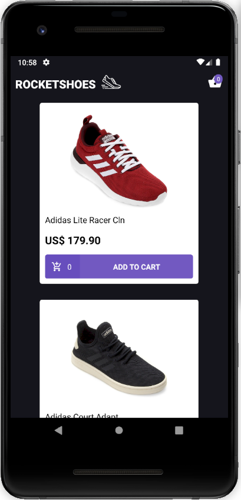
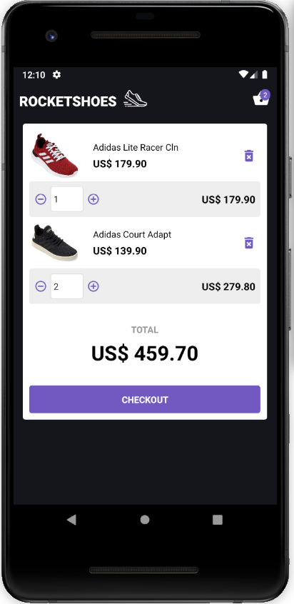

# Rocketshoes - Mobile 
A React App created as a challenge on Rocketseat's 7th Bootcamp module.

## Environment
- OS: Ubuntu 18.04
- Text editor: VS Code 1.37.1
- Android Studio

## Tools
- Axios
- ESLint
- Prettier
- JSON Server
- Styled Components
- Polished
- React Native
- Reactotron
- React Native Vector Icons
- Redux
- Redux Saga

## Running the app:
To start the JSON Server, run:
```bash
$ yarn json-server server.json -p 3333
```

If it's the first time you're running the application, do:
```bash
$ react-native run-android
```

If you've already run the app before, do:
```bash
$ react-native start
```

## Screens
<p align="center">
    
</p>

<p align="center">
    
</p>